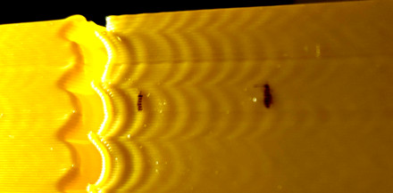
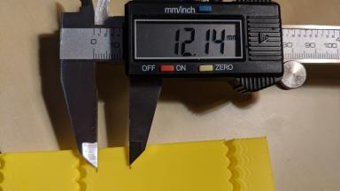
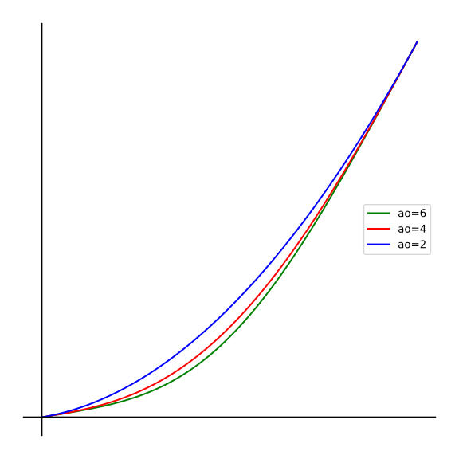
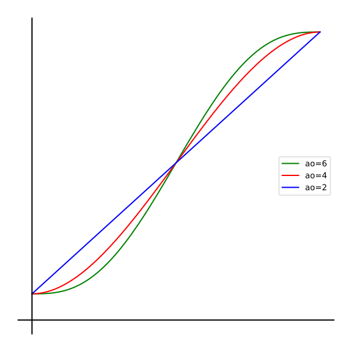
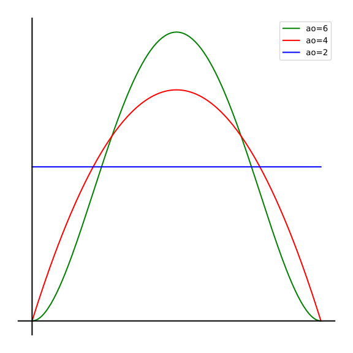
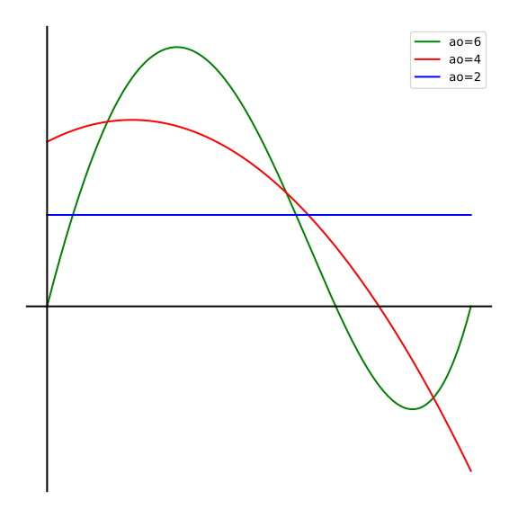

S-Curve acceleration
====================

This document provides an overview of a special mode of acceleration implemented
in Klipper called S-Curve acceleration. This acceleration scheme replaces the
traditional "[trapezoid generator](Kinematics.md#trapezoid-generator)" by modeling higher-order derivatives, like
jerk, snap and so forth, depending on the S-Curve order, using Bezier polynomials.

**Warning**: S-Curve support is experimental. You should consider using high
order acceleration only if you already have some problems with the prints,
otherwise it is not advised to switch over from the default
acceleration_order = 2. Examples of problems S-Curve acceleration may help with:

* Ghosting and ringing in the prints
* Extruder skipping steps or rattling when using
  [Pressure Advance](Pressure_Advance.md):
    * bowden extruder with high pressure advance value
    * direct extruder with high gear ratio (e.g. remote direct drive extruder)

The improvements do not come for free: your prints will likely slow down.
Depending on the model and print parameters, slow down can be from negligible
to 2x and more. On the other hand, the same level of improvements usually cannot
be obtained just by reducing the acceleration.

Note that ghosting usually has mechanical origins: insufficiently rigid printer
frame, non-tight or too springy belts, alignment issues of mechanical parts,
heavy moving mass, etc. Those should be checked and fixed first.

Enable S-Curve acceleration
===========================

To try experimental S-Curve acceleration mode with jerk limit in your existing
Klipper installation, SSH to your Raspberry Pi and run the following commands:
```
$ cd klipper
$ sudo service klipper stop
```

Configure the new Git remote:
```
$ git remote add s-curve-exp https://github.com/dmbutyugin/klipper.git
$ git remote -v
```
The output should list the new remote among other things:
```
s-curve-exp	https://github.com/dmbutyugin/klipper.git (fetch)
s-curve-exp	https://github.com/dmbutyugin/klipper.git (push)
```

Now check the current branch, it will be needed to roll back after you are
finished with the experiments:
```
$ git branch
```
will most likely list
```
* master
```

Check out the new branch:
```
$ git fetch s-curve-exp
$ git checkout s-curve-exp/scurve-jerk-limit
```

Add `acceleration_order` paramter to your `printer.cfg`
configuration file:

```
[printer]
acceleration_order: 6  # or 4
```

Start Klipper:
```
$ sudo service klipper start
```

If you want to switch back to the main Klipper branch, SSH to your Raspberry
Pi and run the following commands:
```
$ cd klipper
$ sudo service klipper stop
$ git checkout master
$ sudo service klipper start
```

S-Curve acceleration tuning
===========================

The quality of the prints when using S-Curve acceleration depends on a
few parameters:

* [Square corner velocity](Kinematics.md#look-ahead)
* Maximum jerk (if S-Curve is enabled)
* Acceleration order

Maximum acceleration and maximum velocity do not have significant impact
on the ringing in this mode and can be set to the values suggested by the
printer manufacturer or the values you normally use. You do not need to
tune these.

## Tuning process

Prepare the [test](https://www.thingiverse.com/thing:3847206) model in the slicer:

 * Suggested layer height is 0.2 or 0.25 mm.
 * Infill and top layers can be set to 0.
 * Use 1-2 perimeters, or even better the smooth vase mode with 1-2 mm base.
 * Use sufficiently high speed, around 80-100 mm/sec, for *external* perimeters.
 * Make sure that the minimum layer time is *at most* 5 seconds.

### Ringing frequency

First, measure the **ringing frequency**. For best results, this should be
done with acceleration_order = 2, high acceleration and square_corner_velocity.

1. Start with the following command `SET_VELOCITY_LIMIT ACCEL_ORDER=2`.
2. Print the test model sliced with suggested parameters.
3. If the ringing is poorly visible, try increasing acceleration with
   `SET_VELOCITY_LIMIT ACCEL=3000` or higher and
   `SET_VELOCITY_LIMIT SQUARE_CORNER_VELOCITY=20` or higher. Basically, you
   need to *decrease* the quality of the print.
4. Measure the distance *D* (in mm) between *N* oscillations along X axis near
   the notches, preferably skipping the first oscillation or two. To measure
   the distance between oscillations more easily, mark the oscillations first,
   then measure the distance between the marks with a ruler or calipers:

    |||
    |:--:|:--:|

5. Compute the ringing frequency = *V* &middot; *N* / *D* (Hz) where *V* is
   the velocity for outer perimeters (mm/sec).
6. Do (4) - (5) for Y axis as well.

For Cartesian printers, you will obtain 2 frequencies, which may be different,
esepcially on bed-slinger printers. For CoreXY printers, repeat the process
(1)-(6) rotating the model 45 degrees around Z axis such that the angle between
the X and Y axes and the sides of the model is 45 degrees; you will get 4
frequencies in total. Delta printers should have 3 frequencies close to each
other; just measure 2 frequencies as for Cartesian printers.

Ringing frequency can depend on the position of the model within the buildplate
and Z height; you can check if you see the differences in frequencies at
different positions along the sides of the test model and at different heights.
On the other hand, the measurements do not have to be very precise, and some
variations in the ringing frequencies are tolerable.

If you got frequencies sufficiently close to each other, you can simply use
the average or the minimum frequency from here. For example, if you got 40 Hz and
60 Hz, 50 Hz average will do. If you got very different frequencies, either use
the smallest (it typically shows the worst ringing), or refer to
[fine tuning](#advanced-fine-tuning-and-troubleshooting).

Now compute `min_jerk_limit_time` parameter as 1.0 / ringing_frequency. Add
the result to the config, e.g.
```
[printer]
min_jerk_limit_time: 0.02  # in sec, corresponds to 50 Hz
```
and restart Klipper using `RESTART` command.

You can re-print the model to check if the quality has improved, be sure to set
`SET_VELOCITY_LIMIT SQUARE_CORNER_VELOCITY=1` before printing for now.

### Square corner velocity

Square corner velocity defines the velocity limit for the toolhead to traverse
the square corners, it is also used to determine the maximum velocity between the
moves with other angles as well. Too high values may significantly increase
the ringing.

Issue `SET_VELOCITY_LIMIT SQUARE_CORNER_VELOCITY=1` command to begin the tuning
process. Print the test model increasing the square corner velocity every 5 mm
by 2-5 mm/sec (e.g. `SET_VELOCITY_LIMIT SQUARE_CORNER_VELOCITY=5` and so on).
The square corner velocity can be changed either manually by issuing G-Code
commands, or by adding them to the generated gcode file (e.g. every 20 layers
with 0.25 mm layer height or every 25 layers with 0.2 mm layer height).
Notice when the ringing becomes apparent, and use the square corner velocity
value before that. Store the value as `square_corner_velocity` parameter in
`printer.cfg` and restart Klipper.

### Pressure Advance

If you use Pressure Advance, it may need to be re-tuned. Follow the
[instructions](Pressure_Advance.md#tuning-pressure-advance) to find the
new value, if it differs from the previous one.

If during the testing you notice that extruder rattles or skip steps, it
means that you may need to reduce `max_jerk` value explicitly. Follow the
suggestions in [fine tuning](#advanced-fine-tuning-and-troubleshooting) section.

### Advanced fine tuning and troubleshooting

There is additional configuration parameter you may need to change if your
printer has very different ringing frequencies, if it cannot keep up
with Pressure Advance, or if you want a different tradeoff between the
quality and the print time. You can additionally configure max jerk parameter:
```
[printer]
max_jerk: ...
```

For a single ringing frequency the suggested max_jerk value is
6 &middot; max_accel &middot; ringing_frequency / RINGING_REDUCTION_FACTOR, with
RINGING_REDUCTION_FACTOR ~ 10.0. If the ringing frequencies are very different,
set

 * min_jerk_limit_time = 1.0 / max_ringing_frequency
 * max_jerk = 0.6 &middot; max_accel &middot; min_ringing_frequency

If you still see poor quality prints after measuring
[ringing frequency](#ringing-frequency) and setting min_jerk_limit_time,
set max_jerk in `[printer]` section explicitly. Then you can try to
decrease min_jerk_limit_time and/or max_jerk values. min_jerk_limit_time impacts
the acceleration of short moves, and max_jerk parameter has effect on all moves.

If you want to decrease print times, you can try increasing max_jerk.
It is not recommended to increase min_jerk_limit_time above
1.0 / min_ringing_frequency value to avoid ringing around resonances.

If extruder struggles with Pressure Advance on very short moves, decrease
min_jerk_limit_time. If there are problems on longer moves and higher
velocity changes, decrease max_jerk value.

Keep in mind that there is no well-defined upper limit on the maximum jerk
value, except when using Pressure Advance. Still, the practical range of values
to choose max_jerk from is from 10'000 mm/sec^3 to around 100'000 - 300'000
mm/sec^3 depending on the printer setup and hardware.


S-Curve acceleration overview
=============================

By default, Klipper uses "trapezoid generator" for each move - each move has
a start speed, it accelerates to a cruising speed at constant acceleration,
it cruises at a constant speed, and then decelerates to the end speed using
constant acceleration.


The basic idea behind S-Curve acceleration is to replace the constant
acceleration and deceleration with polynomials of higher order. For some
choices of the polynomials the toolhead will travel the same path and reach
the same speed as if it was accelerating constantly, but higher order
derivatives (e.g. acceleration, jerk) can be 0 in the beginning and at the end
of acceleration depending on the polynomial order, ensuring better smoothness
of the motion.

Klipper currently supports acceleration_order = 2, 4 and 6.
acceleration_order = 2 is the default constant acceleration mode.
Charts below show the distance covered, velocity and acceleration for different
acceleration orders.

||
|:--:|
| *Distance* |
||
| *Velocity* |
||
| *Acceleration* |

Notice that the velocity and acceleration are smoother with higher acceleration
orders. When acceleration is not constant, the 'lack' of acceleration in
the beginning must be compensated with higher max acceleration. Klipper still
plans all moves considering the 'effective' acceleration, which can be seen as
an average acceleration, but then each move is executed using the polynomial
of the chosen degree. Though instantaneous acceleration exceeds the configured
maximum toolhead acceleration, because the movement is smoother overall,
the reduction of the maximum permitted acceleration is usually not necessary.

Besides making the movements smoother, S-Curve acceleration *may* improve the
quality of the prints. One of the theories behind it is that each printer has
limited non-infinite rigidity of the frame, belts, etc. When the force is
applied or relieved instantly in the beginning and at the end of acceleration
or deceleration, the system can act as a spring and start oscillating, which
can be observed in the form of ringing in the prints. S-Curve acceleration
'spreads' increase and decrease of the force during a longer time, potentially
reducing the oscillations.

This has an important consequence: if the short moves are executed with the
same acceleration, the full force must be applied over the shorter period of
time, effectively nullifying the positive effect of S-Curve acceleration on
short moves. That's why Klipper also limits the maximum kinematic jerk
*J* = *da* / *dt* of each acceleration and deceleration in S-Curve acceleration
mode.

For the chosen polynomials, the maximum kinematic jerk *J* is

*J* = 6 *a* / *T*

for acceleration_order = 4, where *a* is effective acceleration and *T* is
acceleration time. For acceleration_order = 6

*J* = 10 *a* / (*T* &#8730;3) &asymp; 5.774 *a* / *T*.

In the end, we use 6 *a* / *T* < max_jerk condition to limit the jerk. This
leads to a cubic equation

(*v*<sup>2</sup> - *v*<sub>0</sub><sup>2</sup>) &times;
  (*v* + *v*<sub>0</sub>) / 2 = *L*<sup>2</sup> *J* / 3,

which can be solved using Cardano's formula to determine the velocity *v*
after acceleration with the maximum jerk *J* over the segment of length *L*.
The final velocity is chosen as a minimum out of that value and
*v*<sub>0</sub> + (2 *a* *L*)<sup>1/2</sup>.

Another reason to limit the jerk is that it directly translates into extruder
acceleration *a*<sub>e</sub> if Pressure Advance is enabled:
*a<sub>e</sub>* = *r P J*,
where *P* is the pressure advance parameter,

*r* = (4 *w* *h*) / (&pi; *D*<sup>2</sup>).

is the extrusion ratio, *D* is the filament diameter, *w* is the extrusion
width, *h* is the layer height. As an example, with *P* = 0.5, *w* = 0.4 mm,
*h* = 0.2 mm, *D* = 1.75 mm, and *J* = 100'000 the extruder acceleration is
1663 mm/sec^2 due to jerk.

Extruder kinematics looks as follows with different acceleration orders:

||
|:--:|
| *Extruder Velocity* |
||
| *Extruder Acceleration* |

Notice the velocity jump with acceleration_order = 2 (the 'infinite'
acceleration spikes at the beginning and the end of acceleration with
acceleration_order = 2 are not shown). With acceleration_order > 2
the velocity is continuous, and for acceleration_order = 6 it is even
smooth.  Thus, acceleration_order > 2 can improve the performance of
the extruder if pressure advance is enabled.


S-Curve acceleration notes
==========
 * S-Curve reduces acceleration of short moves, effectively slowing them down
    * this can be disabled by setting very high `max_jerk` value in the config,
      e.g. 1000000, but this is not advised
    * jerk limit is not applied to extrude-only moves, they are always executed
      with the full `max_extrude_only_accel` acceleration.
 * When the move must both accelerate and decelerate, and acceleration for the
   move is below `max_accel_to_decel`, Klipper will not generate the traditional
   trapezoid, but will put deceleration right after acceleration. This is not
   much of a problem with acceleration_order > 2 because the transition between
   acceleration and deceleration is smooth anyways (toolhead acceleration is 0
   at the switching point).
 * Instant toolhead acceleration may exceed the configured `max_accel` value.
   `max_accel` serves as a limit for the 'average' acceleration during the move
   with acceleration_order > 2. Still, there is typically no need to reduce
   it, unless the steppers start skipping steps.
 * S-Curve acceleration mode puts less stress on the extruder when pressure
   advance is enabled (unless `max_jerk` is set to a too high value).
 * Klipper stops the toolhead between extrude and non-extrude moves, which, in
   case of S-Curve acceleration, can additionally slow down the prints. Zig-zag
   top/bottom pattern (line/rectilinear in Slic3r), as well as
   'Connect infill lines' setting in Cura can be used when slicing models
   to mitigate this issue to some degree. When these options are enabled,
   slicers will generate mostly connected lines at the top, bottom and infill,
   preventing toolhead from stopping for most of the moves. This has the most
   positive effect if `square_corner_velocity` is set reasonably high.
 * S-Curve acceleration does not work well with `[bed_meshing]` feature
   currently. As mentioned above, S-Curve acceleration slows down short moves.
   Incidentally, bed meshing segments long moves into short ones to account for
   the bed surface height changes. This can lead to inconsistent acceleration
   across the print area depending on segmentation density. If you must use bed
   meshing, you can set fade_start < fade_end options in `[bed_meshing]` section
   to small values (i.e. a few millimeters) to stop Z-height adjustments early
   and set `max_jerk` to a reasonably high value (around 50000 or more) to make
   sure the print is not too slow during these initial few millimeters.